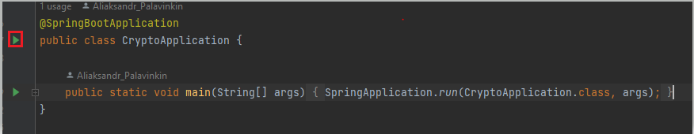

# XM Project

## What is this project about

This project allows us to parse crypto prices and suggest the most advantages crypto.

## What technologies do we use

In this project we use the newest technologies like
1. Spring Boot
2. Spring Data
3. Lombok

As DB we use PostgreSQL

## How to run the application

To run this application locally you should do following steps:
1. Go to `application.properties` file
2. Change username and password to your database
3. Go to `CryptoApplication` class
4. Run `CryptoApplication`

## How to run this application in debug mod

To run this application in debug mod locally you should do following steps:
1. Go to `CryptoApplication` class
2. Debug `CryptoApplication` 

## Crypto support

Now our application supports fixed list of crypto(you can take a look them in `Crypto` enum file)

To add new crypto support you should add it to `Crypto` enum. 